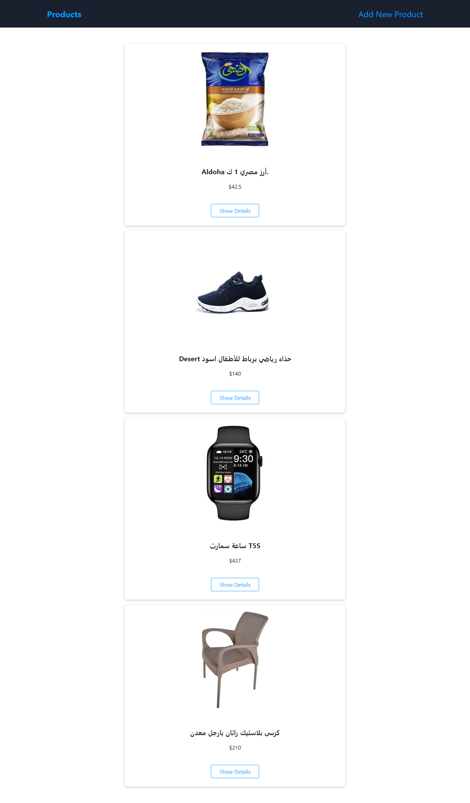

# link preview :

https://nextjs-app-sandy-ten.vercel.app/

# tools :

- html
- css
- javascript
- media query
- next.js v13
- react hooks
- useRouter
- Image optimization by next/image
- mongoDB
- nodejs
- mongooseSchema
- dynamicRoute
- fetch data by axios 

# features
- 4 pages [home page-show details-add products- add new product]
- user can add the products by fill the all required inputs form
- the images is only valid if the hostname is starting with eg.jumia.is
- apply the three principles of  :
- accessibility
- seo
- best practices
